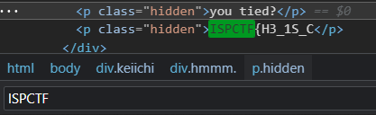

# Keiichi
> Mới đầu vào ta chỉ thấy một bức ảnh làm background, thử inspect xem sources thì ối dồi ôi luôn, một đống code html, có vẻ như flag được giấu ở đây.  
> `Ctrl F ISPCTF` ta tìm được phần đầu của Flag: `ISPCTF{H3_1S_C`
- >

> Nếu như phần 